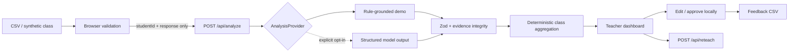

# Misconception Radar

**Turn short answers into evidence-backed misconception clusters and a targeted reteach plan.**

Misconception Radar is a privacy-first formative assessment workspace for high-school physics teachers. It converts a class set of exit-ticket responses into a misconception map, evidence-grounded feedback drafts, and a five-minute reteach plan—while keeping student names in the browser and the teacher in control.

**Live demo:** <https://misconception-radar-july-ai-2026.aegg42.chatgpt.site>

The judged build runs server-side DeepSeek V4 Flash for live analysis and
reteach generation, with an explicitly labeled sample snapshot as its outage
fallback.

## Why this exists

A score tells a teacher who missed a question. It rarely explains *why*.

Misconception Radar looks beneath each answer for a bounded, teacher-reviewed conceptual signal. The MVP focuses on forces and motion, where recurring ideas such as “the heavier object exerts more force” or “moving upward requires a net upward force” are instructionally useful and testable.

## Demo flow

1. Choose one of three curated physics exit tickets.
2. Load the synthetic demo class or upload a CSV with `student_id,student_name,response`.
3. Analyze up to 20 short answers.
4. Inspect the class misconception map and the exact response evidence behind each draft.
5. Review, edit, and approve individual feedback locally.
6. Generate a targeted five-minute reteach plan and exit ticket.
7. Export the teacher-reviewed feedback as CSV.

## Run locally

Requirements: Node.js 20.9 or newer.

```bash
npm install
npm run dev
```

Open `http://localhost:3000`.

The app is fully functional without credentials. Its default `deterministic` provider is a transparent, rule-grounded demonstration engine. An explicitly labeled fixed sample snapshot is also available; it is never presented as live model inference.

### Provider configuration

| Variable | Default | Purpose |
| --- | --- | --- |
| `AI_PROVIDER` | `deterministic` | Set to `deepseek` or `openai` only for an authorized live deployment |
| `ENABLE_LIVE_AI` | `false` | Second explicit gate preventing accidental model calls |
| `DEEPSEEK_MODEL` | `deepseek-v4-flash` | Recommended low-latency judged-build model |
| `DEEPSEEK_API_KEY` | empty | Server-only DeepSeek credential |
| `OPENAI_MODEL` | `gpt-5.6-terra` | Alternate live provider model |
| `OPENAI_API_KEY` | empty | Server-only credential; never expose with a public prefix |
| `NEXT_PUBLIC_APP_URL` | `http://localhost:3000` | Canonical origin for social metadata |

Live requests require all three conditions: a supported `AI_PROVIDER`,
`ENABLE_LIVE_AI=true`, and that provider's server-side credential. The
DeepSeek adapter uses the official OpenAI-compatible Chat Completions endpoint
with JSON Output in non-thinking mode, then applies the same Zod and evidence
integrity checks as every other provider. No real key is included in this
repository.

## Architecture



### Core contracts

- `POST /api/analyze` accepts a template ID and 1–20 anonymous responses.
- `POST /api/reteach` accepts one bounded misconception and up to three anonymous representative responses.
- Student names never enter either request.
- Model outputs, when enabled, must use the same Zod schema as the deterministic provider.
- Evidence quotes must be exact substrings of the original response.
- Class counts and averages are always recomputed in application code.

## Privacy and safety

- Demo content is synthetic.
- Names remain client-side and are joined back to anonymous results in the browser.
- The application has no database, login, history, or automatic student messaging.
- Feedback is labeled as a draft, not a final grade.
- Mixed, ambiguous, and low-confidence reasoning is flagged for teacher review.
- Server logs contain request IDs, row counts, provider names, timings, and error types—never answers or names.

## Evaluation

The repository contains a 30-case, human-labeled synthetic evaluation set across all three assignments. Automated acceptance targets are:

- primary misconception accuracy ≥ 85%;
- draft score within one rubric point ≥ 90%;
- evidence, ID, enum, and rubric integrity = 100%.

Run the complete verification suite:

```bash
npm run verify
npm run test:e2e
npm run test:production
npm run evaluate:live
```

The Playwright suite follows CSV data through anonymous analysis, the
misconception dashboard, student evidence, local feedback approval, reteach
generation, responsive use, and the explicitly labeled outage fallback.
`evaluate:live` is credential-gated and runs all 30 labeled cases three times,
plus one reteach generation, before a live provider can be enabled.

DeepSeek V4 Flash passed that gate on 2026-07-25: all three runs achieved
100% primary-misconception match, 96.67% of draft scores within one rubric
point, and 100% structural/evidence integrity on the synthetic set. These are
prototype qualification results, not a classroom-validity claim.

See [docs/evaluation.md](docs/evaluation.md) for the evaluation design and limitations.

## Sites deployment build

The production package uses the official OpenNext Cloudflare adapter so the
Next.js route handlers remain available in the Worker runtime.

```bash
npm run build:sites
npm run test:sites
npm run archive:sites
```

These commands generate an ignored `.open-next` bundle, a Sites-ready
`dist/client` + `dist/server/index.js` package, and a deployable
`.sites/misconception-radar.tar.gz` archive. The committed
`.openai/hosting.json` contains only the opaque Sites project ID; credentials
and runtime secrets are never written there.

## Technology

- Next.js 16, React 19, TypeScript, Tailwind CSS 4
- Zod, Papa Parse, Recharts
- Vitest, Playwright
- OpenNext Cloudflare Worker packaging
- DeepSeek V4 Flash Chat Completions adapter with JSON Output
- Optional OpenAI Responses API adapter with structured output

## Submission materials

- [Devpost project story](docs/devpost.md)
- [Two-minute video script and shot list](docs/video-script.md)
- [Evaluation notes](docs/evaluation.md)
- [Submission release checklist](docs/release-checklist.md)
- [Sample class CSV](public/sample-class.csv)
- [3:2 Devpost thumbnail source](public/devpost-thumbnail.svg)

## Known limitations

- The MVP covers three curated forces-and-motion prompts, not arbitrary subjects.
- The deterministic provider is a demonstration baseline, not a trained ML model.
- Confidence labels are instructional review signals, not calibrated probabilities.
- Live model quality must be re-evaluated with the same cases before making accuracy claims.

## License

[MIT](LICENSE)
